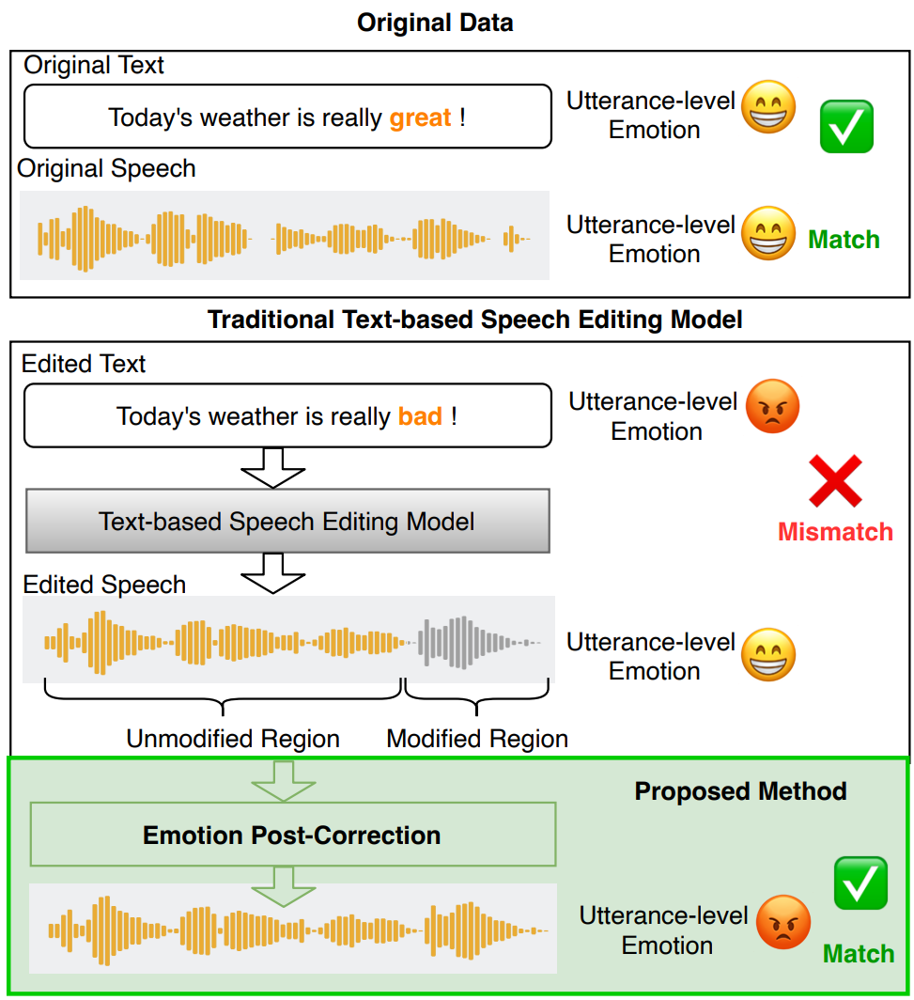
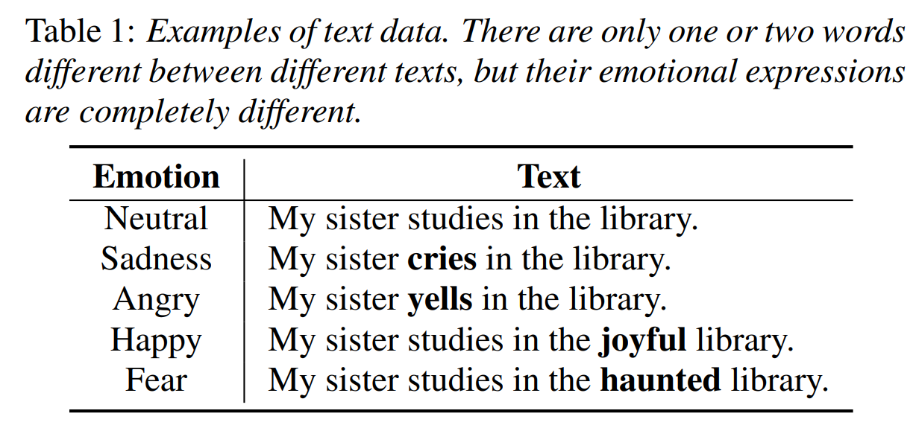
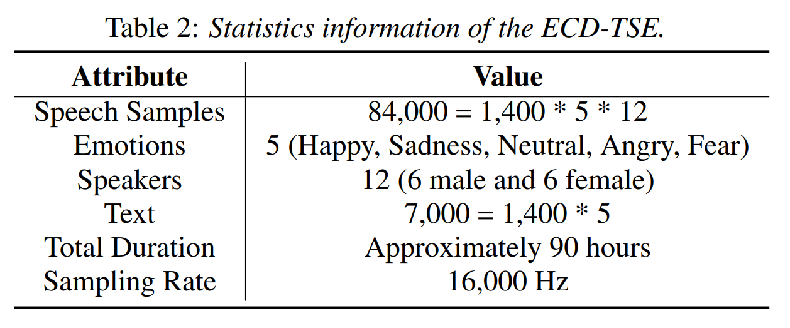

[](https://github.com/Akshay090/svg-banners)

# EmoCorrector

[INTERSPEECH'2025] Towards Emotionally Consistent Text-Based Speech Editing: Introducing EmoCorrector and The ECD-TSE Dataset

📜 👉[Paper](https://arxiv.org/abs/2505.20341) 👈

🎶 👉[Demo](<https://supskil-258.github.io/EmoCorrectorPages/>)👈



## ECD-TSE

### **Download** here : 👉[Dataset](https://huggingface.co/datasets/Gaphy/ECD-TSE)👈

We pioneer the benchmarking Emotion Correction Dataset for TSE (ECD-TSE). The prominent aspect of **ECD-TSE** is its inclusion of  paired data featuring diverse text variations and a range of emotional expressions.





## Install Dependencies

A suitable [conda](https://conda.io/) environment  can be created and activated with:

```
conda env create -f environment.yaml
conda activate EmoCorrector
```


## Download the pre-trained vocoder

Download `model_ckpt_steps_1000000.ckpt`, `config.yaml`, from

https://huggingface.co/Gaphy/EmoCorrector/tree/main/checkpoints to `checkpoints/trainset_hifigan`

## Download the pre-trained encoder

Download files from
https://huggingface.co/j-hartmann/emotion-english-distilroberta-base/tree/main to `retrieval/RoBERTa`

## Data Preprocess

First, set `raw_data_dir`, `processed_data_dir`, `binary_data_dir`, `emo_embedding_dir`  in the config file, and download dataset to `raw_data_dir` .

Then data preprocess:

```
#Extract emotion embedding
CUDA_VISIBLE_DEVICES=0 python extract_emoembedding.py 
#Data preprocess
CUDA_VISIBLE_DEVICES=0 python myprocess.py --config modules/EmoCorrector/config/EmoCorrector.yaml
CUDA_VISIBLE_DEVICES=0 python mytrain_mfa_align.py --config modules/EmoCorrector/config/EmoCorrector.yaml
CUDA_VISIBLE_DEVICES=0 python mybinarize.py --config modules/EmoCorrector/config/EmoCorrector.yaml
```

## Train your own model 

```
CUDA_VISIBLE_DEVICES=0 python myrun.py --config modules/EmoCorrector/config/EmoCorrector.yaml  --exp_name EmoCorrector --reset
```

## Inference

```
CUDA_VISIBLE_DEVICES=0 python myinfer.py --config modules/EmoCorrector/config/EmoCorrector.yaml  --exp_name EmoCorrector --infer
```

## Citations

If you find this code useful in your research, please cite our work:

```
@article{liu2025towards,
  title={Towards Emotionally Consistent Text-Based Speech Editing: Introducing EmoCorrector and The ECD-TSE Dataset},
  author={Liu, Rui and Gao, Pu and Xi, Jiatian and Sisman, Berrak and Busso, Carlos and Li, Haizhou},
  booktitle = {Interspeech 2025},
  year={2025}
}
```


## Tips

If you find any other problems, please contact us.